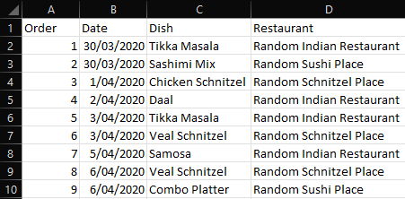
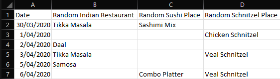

```{r setup, include = FALSE}
library(webexercises)
```

# Welcome!

This workshop is designed to bring your data wrangling skills to the next level, by utilising all of the capabilities of **THE TIDYVERSE**.


The `tidyverse` is a collection of R packages designed for data science. They all share an underlying design philosophy, grammar, and data structures. They all work together and make data wrangling a lot easier compared to base R, and can also integrate easily with lots of cool analysis and visualisation tools.

If you've completed the Cesar liteRacy quiz, you should already have a basic familiarity with R, and have the required packages installed.

Now, without further ado,


### Load all following packages: `tidyr`, `dplyr`, `magrittr`, `readr`, `ggplot2`

You should have all of these packages installed from the literacy quiz, but if not install them using `install.package("package_name")`. 

```{r, warning=FALSE, message=FALSE}
#load packages
library(tidyr)
library(dplyr)
library(readr)
library(ggplot2)

```

### Set your working directory for today

Replace "YOUR_PATHWAY" with the pathway to whichever directory you're using today.

```{r, eval = FALSE}

setwd("YOUR_PATHWAY")

```

`r hide("I hate working directories!")`

Don't worry, there's a solution for you.

One of the many cool features of RStudio is the ability to create R Projects, by clicking File -> New Project...

Projects are self-contained directories. In their most basic form they come with an .Rproj file, which you use to load an R session with the working directory set to the project folder. As long as all of your code and data are contained within this folder, you won't need to mess around with working directories ever again. Not only does this make your own work process neater (because every project has its own data and code compartmentalised), it is also useful when you're working with collaborators - simply send them the entire project folder, complete with the data, code, and .Rproj file, and they have plug-and-play code ready that will work on their system.

Some caveats:

* Even when using projects, code might fail to run on a different computer if there are big differences in versions of R or required packages, and some package installation might be necessary. So it's not a perfect solution for compartmentalising and sharing code.
* Sending data may be a problem if your data take up a lot of space.
* Likewise, multiple projects can use the same underlying data, and if these data take up a lot of space (like spatial data) then creating a copy for each project can really eat up your computer's resources. In these cases, it might be better to keep these data in a separate folder and use the full pathway to import them in your scripts - but then you're back to this not being easy to share with collaborators.

`r unhide()`

We've got us a nifty little dataset showing results of a bioassay performed on multiple populations. Our goal today is to gain some insights around survival dynamics, and eventually create a plot of survival as a function of growth. However, as we'll soon see, there are some steps that need to be taken along the way.

### Import the dataset (Play_data.csv) and store it as an object named `data1`.

```{r}
data1 <- read.csv('Play_data.csv')
```

## Data exploration and manipulation
### Have a look at your data.
### Are your data long or wide?

`r hide("Long and wide? What are you talking about?")`

A brief refresher, taken from iSOP #001 (Dataset Construction):

Your flat dataset can be written in two formats: long and wide. A **long format** has a single column for each variable, as can be seen in the following figure:



A **wide format** spreads a variable across multiple columns. For example, we can spread the “Dish” column across three columns, each corresponding to a different value of the “Restaurant” column:



Both long and wide formats can be useful for different purposes, and one or the other may be more intuitive during data collection depending on the nature of the data and the research question being considered. Occasionally, datasets may even include a mix of long and wide data, and this is usually what we will spend most of our time arranging and adjusting when preparing data for analysis. Some programming languages, libraries and packages will handle data in wide format, others in long format, and converting between the two can be extremely time consuming when a dataset is not constructed with the proper analytical pipeline in mind.

We will usually construct our datasets in long format, also known as **tidy format**. This is the easiest format to use in R. In this format, each *column* represents a single *variable*, each *row* represents a single *observation*, and each *cell* represents a single *value* – always remember this when you are constructing a dataset and want to double-check if your data are in a long, wide, or mixed format.

`r unhide()`


```{r, webex.hide="Click here to see the solution"}
head(data1)
str(data1)
```


Survival was scored at multiple times during the experiment. Today, we will only consider survival at the last scoring time.

### Identify the latest scoring time using `distinct()` and then use `filter()` to create a new dataset that exludes all other scoring times.

```{r, webex.hide="Click here to see the solution"}
distinct(data1, Time)
data2 <- filter(data1, Time == '72h')
str(data2)

table(data1$Population)
```

Raw data often contain more infomation that what we need (e.g., extra traits and general notes) that can make things messy.

Today, we are only interested in 5 coloumns: Population, Rep, Time, Alive, Dead.

### Can you use the `select()` function to create a new dataset only includes these 5 coloumns?

```{r, webex.hide="Click here to see the solution"}
data3 <- select(data2, 'Population', 'Rep', 'Time', 'Alive', 'Dead')
head(data3)
```

We are interested in the survival rate of our critters but we only have the number alive and dead per replicate reported in the dataset.

### We can use the `mutate()` function to create a new dataset with the coloumn for survival rate.

```{r, webex.hide="Click here to see the solution"}
data4 <- mutate(data3, Survival = Alive / (Alive + Dead))
```

We have now created our "Final" dataset that is ready for analysis. However, doing so also required us to make 3 new and seperate datasets along the way... All these extra datasets can add up and create confusion, especially when they have uninformative names like data1, data2, data3, etc. Luckily there is a better way!

### We can use pipes `%>%` to complete all previous steps in a single line of code! 

Pipes are a pretty intuitive way of writing code. The pipe's usage is `LHS %>% RHS`, meaning you move what is written on the left-hand side (LHS) of the pipe into the first argument of the function on the right-hand side (RHS).


This allows you to get around R's native and clumsy way of using many (many) nested parentheses, and write code as you would the English language, left to write. Think of it as "take object *x*, then perform action *y*, then perform action *z*", etc.

So, instead of doing this (clumsy, difficult to follow):

```{r, webex.hide="Show long code"}
filter(
  select(
    mutate(data1,
           Survival = Alive/ (Alive + Dead)),
    'Population', 'Rep', 'Time', 'Alive', 'Dead', 'Survival'),
  Time == '72h')

```

You just do this (neat, intuitive):

```{r, webex.hide="Show long code"}
data1 %>%
  filter(Time == '72h') %>%
  select('Population', 'Rep', 'Time', 'Alive', 'Dead')%>%
  mutate(Survival = Alive/ (Alive + Dead))
```

Notice that the outputs are exactly the same, it's just an easier way of getting to the same solution. Now, save this as a new object and let's move on:

```{r}
data5 <- data1 %>%
  filter(Time == '72h') %>%
  select('Population', 'Rep', 'Time', 'Alive', 'Dead')%>%
  mutate(Survival = Alive/ (Alive + Dead))
```

## Summarising data

Let's get some answers from our data!

### Find the average survival rate using `summarise()`

```{r, webex.hide="Click here to see the solution"}
data5 %>%
  summarise(mean(Survival))
```

Let's say we want to know the average survival for each population.

### Calculate the average suvrvival of each population by using piping to add `group_by()` to code above.

```{r, webex.hide="Click here to see the solution"}
data5 %>%
  group_by(Population) %>%
  summarise(mean(Survival))
```

`r hide("What does group_by() actually do?")`

The `group_by()` function is a really useful one. It creates groups in your data.frame based on all unique values of a variable. Then, every function you run on the data.frame will run on the groups separately. This can either have no effect, or a huge effect, depending on which function you run.

When you run `group_by()`, notice the grouping variables (and number of groups) are now explicitly listed:

```{r}
data5 %>%
  group_by(Population)
```

There are four groups, because that is how many unique values there are for the `Population` variable:

```{r}
unique(data5$Population)
```

Let's use the `slice_head()` function to show how `group_by()` works. `slice_head()` is used to select a few (top) rows from a data.frame. So, if we run:

```{r}
data5 %>%
  slice_head(n = 3)
```

We get the first three rows of our data.frame. But, if we use `group_by()`:

```{r}
data5 %>%
  group_by(Population) %>%
  slice_head(n = 3)
```

Now we have the first three rows of each population! Neat.

One thing that is important to notice is that groups are inherited through each stage of the piping process. Even after running the function `slice_head()`, the grouping remains, and any subsequent function we run will still act on the groups. However, we can use `ungroup()` to remove the groups, and then run subsequent functions on the entire data.frame:

```{r}
data5 %>%
  group_by(Population) %>%
  slice_head(n = 3) %>%
  ungroup() %>%
  slice_head(n = 3)
```

Basically, we have a really powerful tool that allows us to manipulate our data using combinations of `group_by()`, `summarise()`, `ungroup()`, and other functions. We can create long pipes to do lots of cool data wrangling options, and we can also group by several variables (for example `group_by(Population, Time)`) and ungroup by some, but not all, of the grouped variables (`ungroup(Population)`). We encourage you to play around with these functions to become comfortable with them, they are among the most powerful tools in the `tidyverse` arsenal.

`r unhide()`

### using `count()`, Find the total number of replicates of each population and the total number of individuals across all replicates.

```{r, webex.hide="Click here to see the solution"}
data5 %>%
  group_by(Population) %>%
  count()
```

`r hide("Something here falls off.")`

You're right! Turns out there's an easier (and a harder) way to do this exercise.

The harder way is without the `count()` function. If we think about the operations we are doing here, we are grouping our data.frame by the Population variable, and then summarising - how many observations are there in each group? Counting things in base R is done using the `length()` function, or in the `dplyr` package using the `n()` function. The difference is that `length()` requires an input vector, which needs to be specificed explicitly. `n()` is part of the `tidyverse`, so it fits neatly within its grammar, and infers the input vector from the previous steps in the pipe.

So, we can do either of these two options:
```{r}
data5 %>%
  group_by(Population) %>%
  summarise(n = length(Population))

data5 %>%
  group_by(Population) %>%
  summarise(n = n())
```

But wait, if `tidyverse` already has `n()`, what's the point of `count()`? Turns out `count()` is a good example of the many quality-of-life functions `tidyverse` has to offer.

`df %>% count(a)` is equivalent to `df %>% group_by(a) %>% summarise(n = n())`. It's basically a function that wraps a bunch of other functions into it, and allows you to write neater, shorter code.

So we could have completed the above exercise using the much simpler
```{r}
data5 %>%
  count(Population)
```

`r unhide()`

`mutate()` and `summarise()` can also be used with more complicated functions, that can accept multiple columns in the data.frame as input.

### Using `summarise()`, Find the total number of individuals tested within each population

```{r, webex.hide="Click here to see the solution"}
data5 %>%
    group_by(Population) %>%
    summarise(total = sum(Alive + Dead))
```


Now we have the data all neat and tidy, let's save this version so we can send it to other people.

```{r}
write.csv(data5, 'cool_old_data.csv')
```

## Combining datasets

Oh cool someone sent us some new data on growth rates! Let's add this to our existing dataset!

### Import the data
```{r}
data_new <- read.csv('Oh_cool_some_new_data.csv')
```


### Have a look at your data.
### Are your data long or wide?

```{r}
head(data_new)
str(data_new)
```

The new data have a different format (wide) than your old data (long). Before we can combine them, we need them to be in the same format.

### Convert `data_new` to a long format.

```{r, webex.hide="Click here to see the solution"}
data_size <- data_new %>%
  pivot_longer(cols = c('Brunswick',	'Carlton','Coburg',	'Northcote'),
               names_to = "Population" , 
               values_to = "Growth")
```

`r hide ('Can I do the opposite?')`

Yes!

The `pivot_wider()` function does the exact opposite of `pivot_longer()`.

```{r}
data_size %>%
  pivot_wider(names_from = "Population",
              values_from = "Growth")
```

Using these two functions you can easily switch your data between long and wide formats. This is useful because even though most analyses and visualisation in R use long data, some things are easier to do on wide data. For example, say we want to add 5 to all growth values in the Brunswick population, but not in the other populations. This be easily accomplished in wide data, and we can use piping to do a quick transformation to wide, run this operation, then switch back:

```{r}
data_size %>%
  pivot_wider(names_from = "Population",
              values_from = "Growth") %>%
  mutate(Brunswick = Brunswick + 5) %>%
  pivot_longer(cols = c('Brunswick',	'Carlton','Coburg',	'Northcote'),
               names_to = "Population" , 
               values_to = "Growth")
```

You can do this without the transformation, but this would require incorporating `if()` clauses or using `case_when()` within `mutate()`, and creating somewhat more complex functions than just X + 5. At the end, it's up to you to try out different options and choose whichever fits your coding style best. R is versatile, and there are often multiple solutions to a single problem.

`r unhide()`

### Combine the two datsets using one of the `join()` functions
```{r, webex.hide="Click here to see the solution"}
df_fin <- left_join(data5, data_size, by=c('Population', 'Rep'))
```

`r hide("What do you mean by 'one of'?")`

`tidyverse` has several functions available to join data.frames. They all share a similar syntax, which requires the following arguments:
* `x` - the first data.frame
* `y` - the second data.frame
* `by` - which columns to join by

The functions then look for matching values in `x` and `y` based on the columns provided in `by`. If no matches are found, then `NA` is returned. This can happen when you are combining datasets with incomplete information - for example, if `y` has a population that is missing from `x`.

The four join functions are:
* `inner_join()`: includes all rows in `x` and `y`.
* `left_join()`: includes all rows in `x`.
* `right_join()`: includes all rows in `y`.
* `full_join()`: includes all rows in `x` or `y`.

`inner_join()` will never return `NA`s. If no matches are found, the row is dropped.
`left_join()` and `right_join()` are equivalent to using Excel's VLOOKUP function to add values from `y` to `x`, or to add values from `x` to `y`, respectively. Only unlike Excel, it does this over all columns, instead of just one. `NA`s can occur for missing matches. So for example, if you use `left_join()` by column `a` and `x` has values of `a` that don't exist in `y`, those rows will have `NA` in all columns from `y`.
`full_join()` fully combines the two data.frames, and `NA` values can show up in columns from both `x` and `y` if there are values of the joining column `a` in `x` that don't appear in `y` and vice versa.

By the way, a good way to anticipate if joins will result in `NA`s, or to explore why you got `NA`s, is to compare the two data.frames for mismatching values. `tidyverse` has a bunch of handy functions to compare elements of two vectors, such as `intersect()`, `union()`, or `setdiff()`. It's worth exploring these.

`r unhide()`

### Can you create a plot of survival as a function of growth?

```{r, webex.hide="Click here to see the solution"}
df_fin %>%
  ggplot(aes(x = Growth, y = Survival, colour = Population)) +
  geom_point() +
  geom_smooth(method = "lm")
```

`r hide("Hey, plotting is fun. Show me more!")`

R is amazing for data visualisation. And especially `tidyverse`, using the extremely powerful `ggplot2` package.


However, using `ggplot2` is an entire can of worms. But if you found this workshop useful, let us know! We might be able to put on another workshop focusing on data visualisation.

`r unhide()`