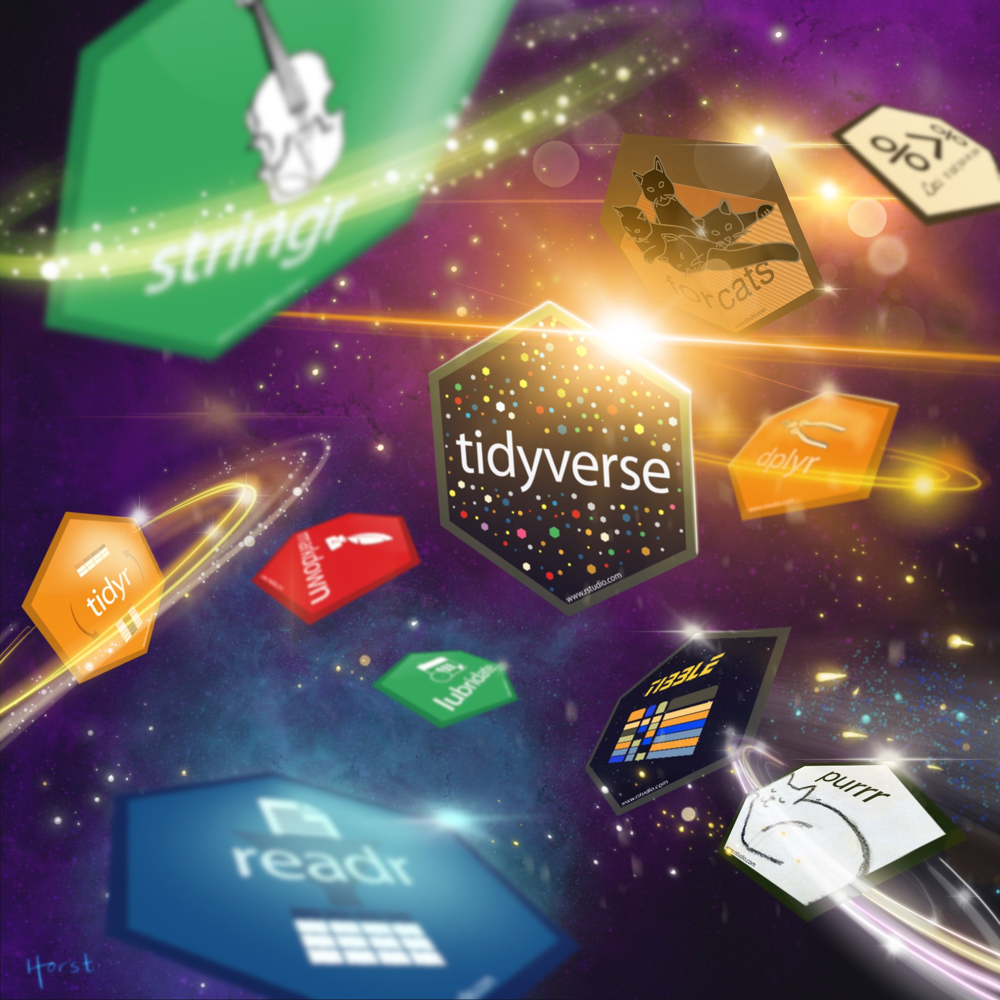

```{r setup, include = FALSE}
library(webexercises)
```

# Welcome!

This workshop is designed to bring your data wrangling skills to the next level, by utilising all of the capabilities of **THE TIDYVERSE**.



The `tidyverse` is a collection of R packages designed for data science. They all share an underlying design philosophy, grammar, and data structures. They all work together and make data wrangling a lot easier compared to base R, and can also integrate easily with lots of cool analysis and visualisation tools.

If you've completed the Cesar liteRacy quiz, you should already have a basic familiarity with R, and have the required packages installed.

Now, without further ado,


## Task 1.
### Load all following packages: `tidyr`, `dplyr`, `magrittr`, `readr`, `ggplot2`

You should have all of these packages installed from the literacy quiz, but if not install them using `install.package("package_name")`. 

```{r, warning=FALSE, message=FALSE}
#load packages
library(tidyr)
library(dplyr)
library(readr)
library(ggplot2)

```


## Task 2.
### Set your working directory for today

Replace "YOUR_PATHWAY" with the pathway to whichever directory you're using today.

```{r, eval = FALSE}

setwd("YOUR_PATHWAY")

```

`r hide("I hate working directories!")`

Don't worry, there's a solution for you.

One of the many cool features of RStudio is the ability to create R Projects, by clicking File -> New Project...

Projects are self-contained directories. In their most basic form they come with an .Rproj file, which you use to load an R session with the working directory set to the project folder. As long as all of your code and data are contained within this folder, you won't need to mess around with working directories ever again. Not only does this make your own work process neater (because every project has its own data and code compartmentalised), it is also useful when you're working with collaborators - simply send them the entire project folder, complete with the data, code, and .Rproj file, and they have plug-and-play code ready that will work on their system.

Some caveats:

* Even when using projects, code might fail to run on a different computer if there are big differences in versions of R or required packages, and some package installation might be necessary. So it's not a perfect solution for compartmentalising and sharing code.
* Sending data may be a problem if your data take up a lot of space.
* Likewise, multiple projects can use the same underlying data, and if these data take up a lot of space (like spatial data) then creating a copy for each project can really eat up your computer's resources. In these cases, it might be better to keep these data in a separate folder and use the full pathway to import them in your scripts - but then you're back to this not being easy to share with collaborators.

`r unhide()`

## Task 3.
### Import the dataset (workshop_2_data.csv) and store it as an object named data
```{r}
data1<-read.csv('Play_data.csv')
```

## Task 4.
### Have a look at your data
### Is your data long or wide?
```{r}
head(data1)
str(data1)
```


## Task 5.
### Surivial was scored at multiple times during the experiment.Today, we will only consider survival at the last scoring time
### Idetify the latest scoring time using `distinct()` and then use `filter()` to create a new dataset that exludes all other scoring times
```{r}
distinct(data1,Time)
data2<-filter(data1, Time=='72h')
str(data2)

table(data1$Population)
```
## Task 6.
### Raw data often contain more infomation that what we need (e.g., extra traits and general notes) that can make things messy
### Today, we are only interested in 5 coloumns: Population, Rep, Time, Alive, Dead 
### Can you use the `select()` function to create a new dataset only includes these 5 coloumns? 
```{r}
data3<-select(data2,'Population', 'Rep', 'Time', 'Alive', 'Dead')
head(data3)
```

## Task 7.
### We are interested in the survival rate of our critters but we only have the number alive and dead per replicate
### We can use the `mutate()` function to create new dataset with the coloumn for survival rate

```{r}
data4<-mutate(data3, Survivial=Alive/(Alive+Dead))
```

## Task 8.
### Tasks 4-6 have allowed us create our "Final" dataset that is ready for analysis. However, doing so also required us to make 3 new and seperate dataset along the way... All these extra datasets can add up and create confusion. Luckily there is a better way!

### We can use pipes "%>%" to complete tasks 4-6 in a single line of code.  
######## NOTE EVATT NEEDS TO MAKE SLIDES TO EXPLAIN PIPES #####
```{r}
data5<-data1%>%
  filter(Time=='72h')%>%
  select('Population', 'Rep', 'Time', 'Alive', 'Dead')%>%
  mutate(Survivial=Alive/(Alive+Dead))
```

## Task 9.
### Let's get some answers from our data!
### Find the  average survival using `summarise()`
```{r}
data5%>%
  summarise(mean(Survivial))
```


## Task 10.
### Now we want to know the average survival for each population
### Calculate the average suvivial of each population by using piping to add with `group_by()` to code above.
```{r}
data5%>%
  group_by(Population)%>%
  summarise(mean(Survivial))
```


###Task 10
### using `count()`, Find the total number of replicates of each population and the total number of individuals across all replicates

```{r}
data5%>%
    group_by(Population)%>%
    count()
```

### using `summarise()`, Find the total number of individuals tested within each population

```{r}
data5%>%
    group_by(Population)%>%
    summarise(total=sum(Alive+Dead))
```


## Task 11.
### Now we have the data all neat and tidy, let's save this version and send to send to other people.
```{r}
write.csv(data5, 'cool_old_data.csv')

```


## Task 12
### Oh cool someone sent us some new data! Let's add this to our existing dataset!
### Import the data
```{r}
data_new<-read.csv('Oh_cool_some_new_data.csv')
```

## Task 4.
### Have a look at your data
### Is your data long or wide?
```{r}
head(data_new)
str(data_new)
```
## Task 13.
### the new data has a different format (wide) than your old data (narrow)
### before we can combine them, we need them to be in the same format
```{r}
data_size<-data_new %>% pivot_longer(cols=c('Brunswick',	'Carlton','Coburg',	'Northcote'),
                          names_to = "Population" , 
                          values_to = "Growth")

```


## Task 14.
### combine datsets using join
```{r}
df_fin <- left_join(data5, data_size, by=c('Population', 'Rep'))
```

## Task 15.
### plot(if we have time)
```{r}
df_fin%>%
ggplot(aes(x=Growth, y=Survivial)) + geom_point()
```